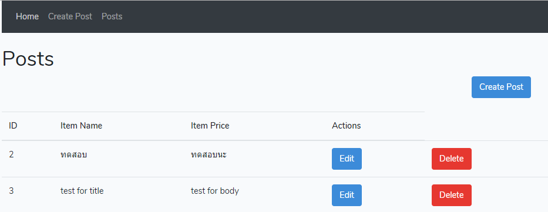

# laravel6 with Vue.js 
Simple application with Laravel 6.x CRUD with Vue.js

## Tale of contents
- [Installation](#installation)
- [Setting up for V-Host](#setting-up-for-v-host)

## Installation

## Via Laravel Installer

```bash
$ composer global require laravel/installer
$ laravel new vuelaravelcrud
```

## Via Composer Create-Project

```bash
$ composer create-project --prefer-dist laravel/laravel vuelaravelcrud
```


## SETTING UP FOR V-HOST

```bash
<VirtualHost *:80>
  ServerName demo.laravel6.crud.local
  ServerAlias demo.laravel6.crud.local
  DocumentRoot "D:/xampp_7_3_9/htdocs/DEMO_LARAVEL6_CRUD/public"
  ErrorLog "logs/demo.laravel6.crud.local-error.log"
  CustomLog "logs/demo.laravel6.crud.local-access.log" common
  <Directory "D:/xampp_7_3_9/htdocs/DEMO_LARAVEL6_CRUD">
    Options +Indexes +Includes +FollowSymLinks +MultiViews
    AllowOverride All
    Require local
  </Directory>
</VirtualHost>
```

## HOST FILE

```bash
127.0.0.1       http://demo.laravel6.crud.local
::1             http://demo.laravel6.crud.local
```

## HOST FILE (Docker Version)
```bash
192.168.99.100 http://demo.laravel6.crud.local
```


## SNAPSHORT

